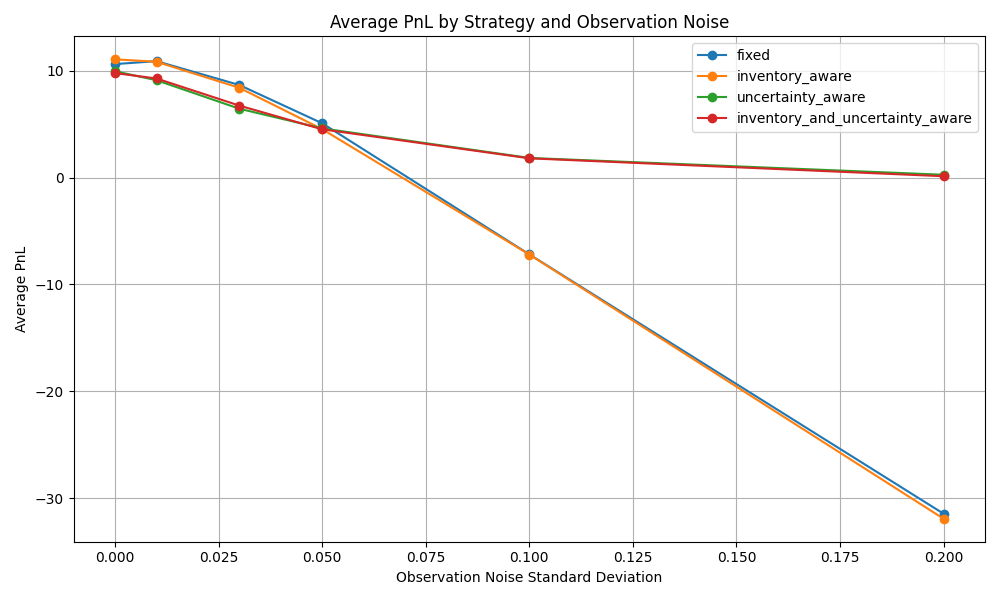
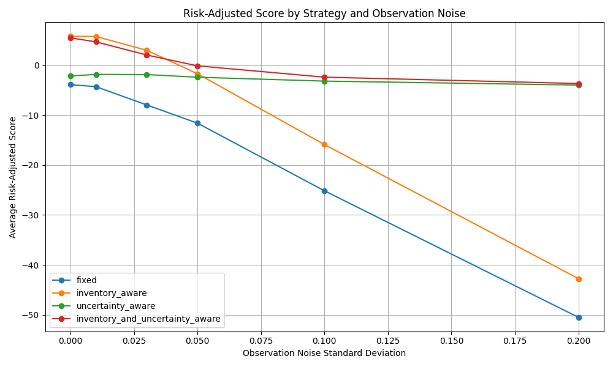
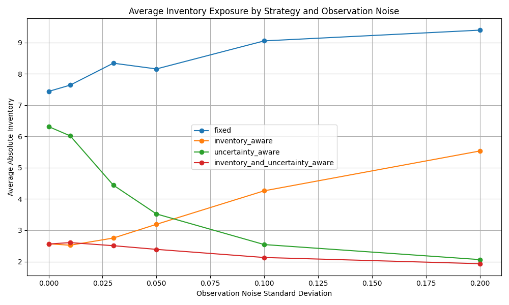
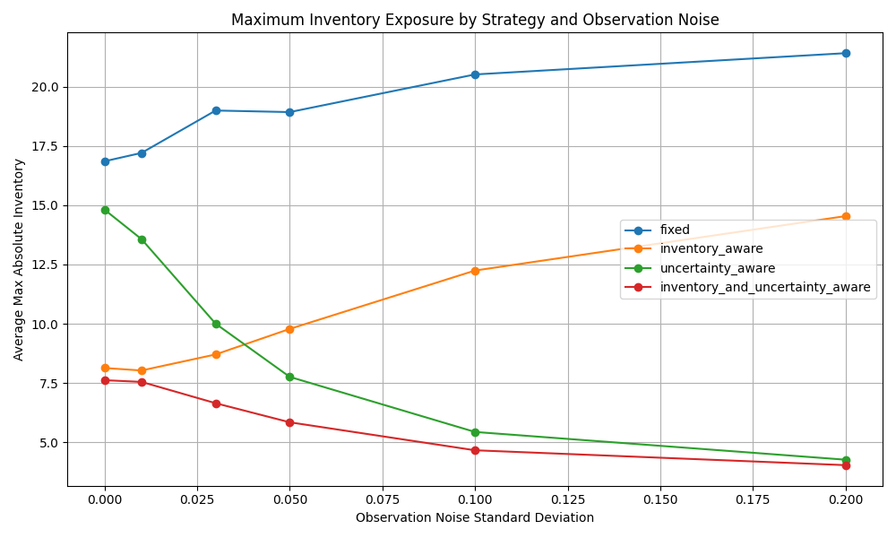
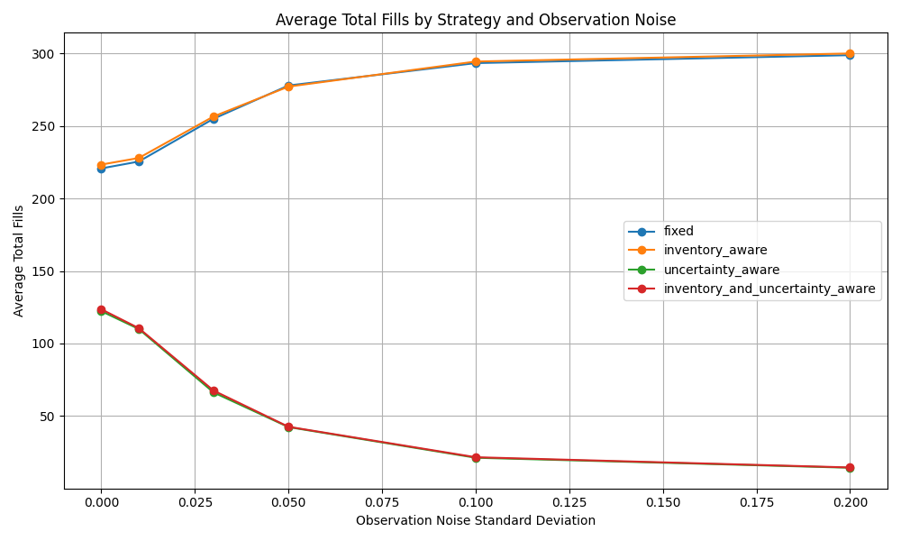
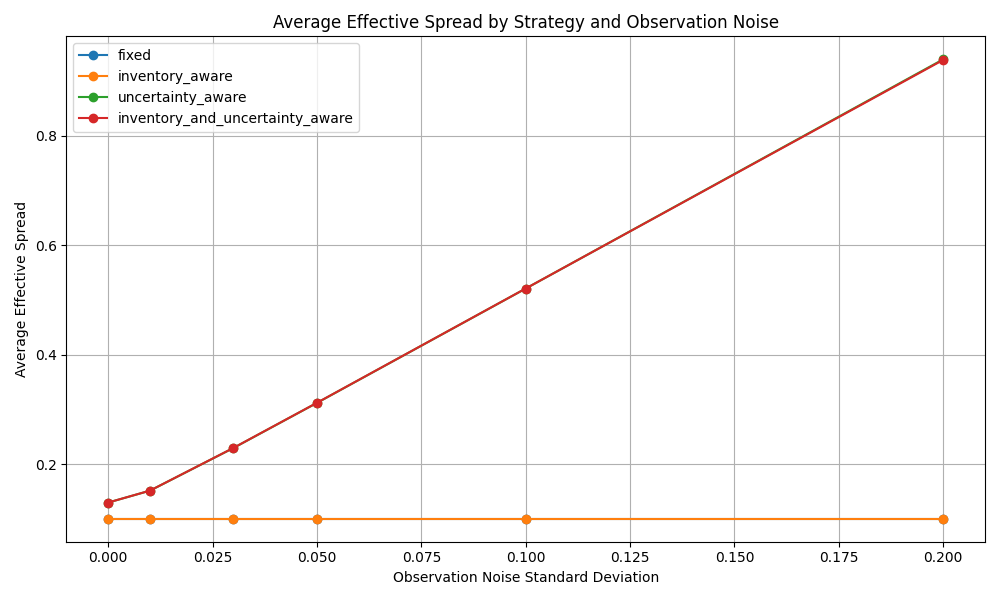

# Stochastic Market-Making Simulator

A Python simulator for testing market-making strategies under stochastic price movement, noisy price observations, inventory risk, and uncertainty-aware spread adjustment.

The project compares several quoting strategies:

* fixed-spread market making
* inventory-aware market making
* uncertainty-aware market making
* combined inventory-and-uncertainty-aware market making

The goal is to study the tradeoff between spread capture, fill frequency, inventory exposure, and risk-adjusted performance.

---

## Motivation

Market makers provide liquidity by continuously quoting a bid price and an ask price. They earn money by buying near the bid and selling near the ask, but they also face several risks:

1. **Inventory risk**: accumulating a large long or short position can become dangerous if the price moves against the market maker.
2. **Fair-value uncertainty**: if the market maker observes a noisy or inaccurate price signal, it may quote around the wrong value.
3. **Adverse selection**: the market maker may be filled precisely when its quote is too favorable to the other side.

This simulator explores how different quoting rules perform under these risks.

---

## Current Model

The simulator uses a simplified discrete-time market.

At each time step:

1. The true midprice moves randomly.
2. The bot observes a noisy version of the true midprice.
3. The bot posts a bid and ask quote.
4. Fill probabilities are determined by how far the quotes are from the true midprice.
5. The bot updates cash, inventory, and PnL.
6. The simulation tracks risk and performance metrics.

The bot does not directly observe the true midprice. It only sees the noisy observed midprice.

---

## Price Process

The true midprice begins at:

```text
initial_price = 100.00
```

At each time step, the true price moves randomly by one cent:

```python
price_change = random.choice([-0.01, 0.01])
true_mid_price += price_change
```

This is a simple random walk. Later versions may replace this with more realistic stochastic processes such as Brownian motion, Ornstein-Uhlenbeck mean reversion, or regime-switching volatility.

---

## Noisy Price Observation

The bot does not perfectly observe the true midprice. Instead, it observes:

```python
observed_mid_price = true_mid_price + observation_noise
```

where:

```python
observation_noise = random.gauss(0.0, observation_noise_std)
```

The simulator controls `observation_noise_std`, but the bot does not directly know this value. The bot only sees the noisy observed price.

This creates fair-value uncertainty. When observation noise is high, the bot may quote around the wrong price and receive adverse fills.

---

## Fill Probability Model

The probability of getting filled depends on how far the bot's quote is from the true midprice.

The fill probability is modeled as:

```python
probability = base_fill_probability * exp(-sensitivity * distance_from_true_mid)
```

where:

* `base_fill_probability` is the maximum baseline fill probability
* `sensitivity` controls how quickly fill probability decays with distance
* `distance_from_true_mid` measures how far the quote is from the true midprice

This captures the basic intuition:

```text
quote close to fair value  -> higher fill probability
quote far from fair value  -> lower fill probability
```

If the bot quotes very aggressively, such as bidding above the true midprice or asking below the true midprice, the distance is clamped to zero. This represents a quote that is highly attractive to the other side and therefore very likely to be filled.

---

## Strategies

### 1. Fixed Strategy

The fixed strategy always quotes around the observed midprice using a constant spread.

```python
quote_mid_price = observed_mid_price
effective_spread = base_spread
```

Then:

```python
bid_price = quote_mid_price - effective_spread / 2
ask_price = quote_mid_price + effective_spread / 2
```

This strategy performs well when the observed price is accurate, but it can perform poorly when observations are noisy.

---

### 2. Inventory-Aware Strategy

The inventory-aware strategy shifts its quote midpoint based on current inventory.

```python
quote_mid_price = observed_mid_price - inventory_skew * inventory
```

If inventory is positive, the bot is long. It shifts quotes downward to encourage selling and discourage buying more.

If inventory is negative, the bot is short. It shifts quotes upward to encourage buying back and discourage selling more.

This strategy reduces inventory exposure but does not directly protect against noisy price observations.

---

### 3. Uncertainty-Aware Strategy

The uncertainty-aware strategy estimates recent market uncertainty using the standard deviation of recent observed price changes.

```python
estimated_uncertainty = standard_deviation(recent_observed_price_changes)
```

It then widens the spread when estimated uncertainty is high:

```python
effective_spread = base_spread + uncertainty_sensitivity * estimated_uncertainty
```

This means:

```text
stable observed prices  -> quote tighter
jumpy observed prices   -> quote wider
```

The bot does not know the true observation noise. It estimates uncertainty only from recent observed price movements.

---

### 4. Inventory-and-Uncertainty-Aware Strategy

This strategy combines inventory-aware midpoint shifting with uncertainty-aware spread widening.

```python
quote_mid_price = observed_mid_price - inventory_skew * inventory
effective_spread = base_spread + uncertainty_sensitivity * estimated_uncertainty
```

It attempts to manage both:

* inventory risk
* fair-value uncertainty

This is currently the most robust strategy in the simulator.

---

## Performance Metrics

Each strategy is evaluated over many simulation trials.

The simulator tracks:

* average PnL
* PnL standard deviation
* risk-adjusted score
* average absolute inventory
* maximum absolute inventory
* total fills
* average effective spread
* estimated uncertainty

Final PnL is computed as:

```python
final_pnl = cash + inventory * true_mid_price
```

This is mark-to-market PnL. Cash alone is not enough because the bot may still hold inventory at the end of the simulation.

The risk-adjusted score is:

```python
risk_adjusted_score = final_pnl - risk_penalty * average_abs_inventory
```

This penalizes strategies that earn PnL while carrying large inventory exposure.

---

## Experiment Setup

The main experiment compares four strategies across different observation-noise levels:

```python
noise_levels = [0.00, 0.01, 0.03, 0.05, 0.10, 0.20]
```

The strategies tested are:

```python
strategies = [
    ("fixed", 0.0),
    ("inventory_aware", 0.002),
    ("uncertainty_aware", 0.0),
    ("inventory_and_uncertainty_aware", 0.002),
]
```

Each strategy/noise combination is run over many trials, and the results are averaged.

Experiment outputs are saved to:

```text
results/experiment_results.csv
```

Plots are saved to:

```text
results/plots/
```

---

## Results

### Average PnL



At low observation noise, fixed and inventory-aware strategies achieve the highest average PnL because they quote tightly and capture spread efficiently.

As observation noise increases, fixed-spread strategies become vulnerable. They continue quoting with the same spread even when their price estimate is unreliable. This causes them to receive adverse fills and suffer large losses.

The uncertainty-aware strategies avoid the worst high-noise losses by widening spreads and trading less frequently.

---

### Risk-Adjusted Score



The risk-adjusted score penalizes inventory exposure.

Inventory-aware quoting performs well when observation noise is low because it captures spread while keeping inventory smaller than the fixed strategy.

At higher noise levels, uncertainty-aware strategies perform much better than fixed-spread strategies. The combined inventory-and-uncertainty-aware strategy is the most robust because it controls both inventory exposure and noisy-observation risk.

---

### Average Inventory Exposure



The fixed strategy carries the highest average inventory exposure across noise levels.

The inventory-aware strategy significantly reduces inventory exposure compared to fixed quoting, especially at low noise.

The combined strategy has the lowest average inventory exposure at higher noise levels because it both adjusts quotes based on inventory and widens spreads when observed prices become unstable.

---

### Maximum Inventory Exposure



Maximum inventory exposure is important because large positions can create large losses if the price moves against the bot.

The fixed strategy reaches the largest inventory positions. Inventory-aware and combined strategies keep maximum inventory much lower.

The combined strategy has the best inventory-risk control overall.

---

### Average Total Fills



Fixed and inventory-aware strategies receive many fills, especially as observation noise increases. However, more fills are not always better.

At high noise, frequent fills often indicate adverse selection: the bot is getting filled because its quotes are too favorable to other traders.

Uncertainty-aware strategies sharply reduce fill counts as noise increases. By widening spreads, they avoid many bad trades.

---

### Average Effective Spread



Fixed and inventory-aware strategies always use the same base spread.

Uncertainty-aware strategies increase their effective spread as observed price movements become more volatile. This confirms that the uncertainty-estimation mechanism is behaving as intended.

Even at zero observation noise, the uncertainty-aware spread is slightly above the base spread because the true price itself still moves randomly. The bot estimates uncertainty from observed price changes, so it captures both true price volatility and observation noise.

---

## Key Findings

The experiment suggests several important conclusions:

1. **Fixed-spread quoting works best when price observations are accurate.**
   When the bot has a reliable estimate of fair value, quoting tightly captures spread efficiently.

2. **Fixed-spread quoting breaks down under noisy observations.**
   As observation noise increases, the bot often quotes around the wrong price and receives adverse fills.

3. **Inventory-aware quoting reduces position risk.**
   Shifting quotes based on inventory lowers both average and maximum inventory exposure.

4. **Inventory control alone does not solve fair-value uncertainty.**
   Inventory-aware quoting still performs poorly at high observation noise because it continues using a fixed spread.

5. **Uncertainty-aware spread widening protects the bot in noisy regimes.**
   By estimating recent observed-price volatility and widening spreads, the bot reduces bad fills.

6. **The combined strategy is the most robust.**
   Combining inventory-aware midpoint adjustment with uncertainty-aware spread widening gives the best overall risk control.

---

## Current Limitations

This is still a simplified simulator.

Current limitations include:

* no real limit order book yet
* no price-time priority
* no order sizes beyond one unit
* no transaction fees
* no latency
* no competing market makers
* no informed traders explicitly modeled
* simple random-walk price process
* simplified exponential fill-probability model
* no calibration to real market data

These limitations are intentional at the current stage. The goal is to first build a clear strategy-testing framework before adding market microstructure complexity.

---

## Future Work

Planned improvements include:

1. **Refactor the project structure**

   * separate simulator, strategies, fill model, statistics, and experiments into different modules

2. **Add better stochastic price models**

   * Brownian motion
   * Ornstein-Uhlenbeck mean reversion
   * regime-switching volatility

3. **Add Poisson order arrivals**

   * model buy and sell market orders as stochastic arrival processes

4. **Build a simplified limit order book**

   * bids and asks
   * price-time priority
   * limit orders
   * market orders
   * cancellations

5. **Add competing agents**

   * noise traders
   * informed traders
   * other market makers

6. **Optimize strategy parameters**

   * grid search over spreads, inventory skew, and uncertainty sensitivity
   * maximize a risk-adjusted objective

7. **Add a dashboard**

   * interactive controls for spread, noise, inventory skew, and uncertainty sensitivity
   * live plots of PnL, inventory, fills, and spreads

---

## How to Run

Clone the repository and install dependencies:

```bash
pip install -r requirements.txt
```

Run the experiment:

```bash
python3 src/toy_simulator.py
```

This will generate:

```text
results/experiment_results.csv
results/plots/
```

---

## Project Status

Current stage:

```text
Phase 2: Experiment results and visualization
```

Completed:

* toy market-making simulator
* quote-distance-based fill probability
* inventory-aware quoting
* noisy price observations
* uncertainty-aware spread adjustment
* multi-trial experiments
* CSV result export
* strategy comparison plots

Next steps:

* write cleaner project structure
* improve stochastic models
* add tests
* build a simplified limit order book
