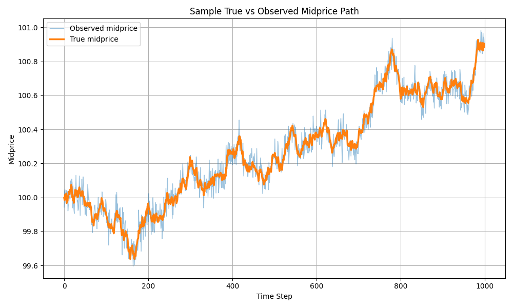
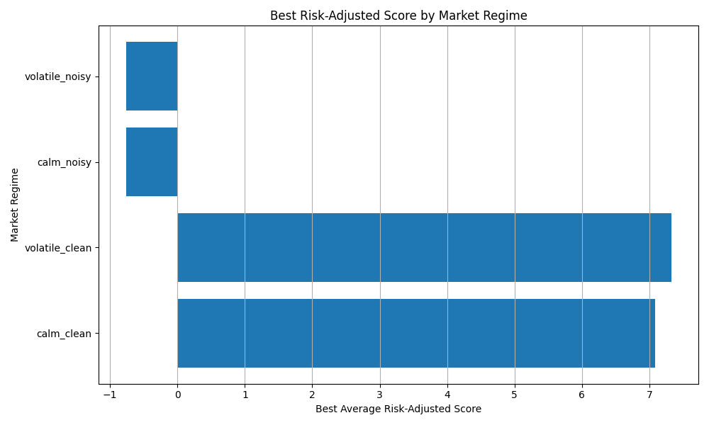
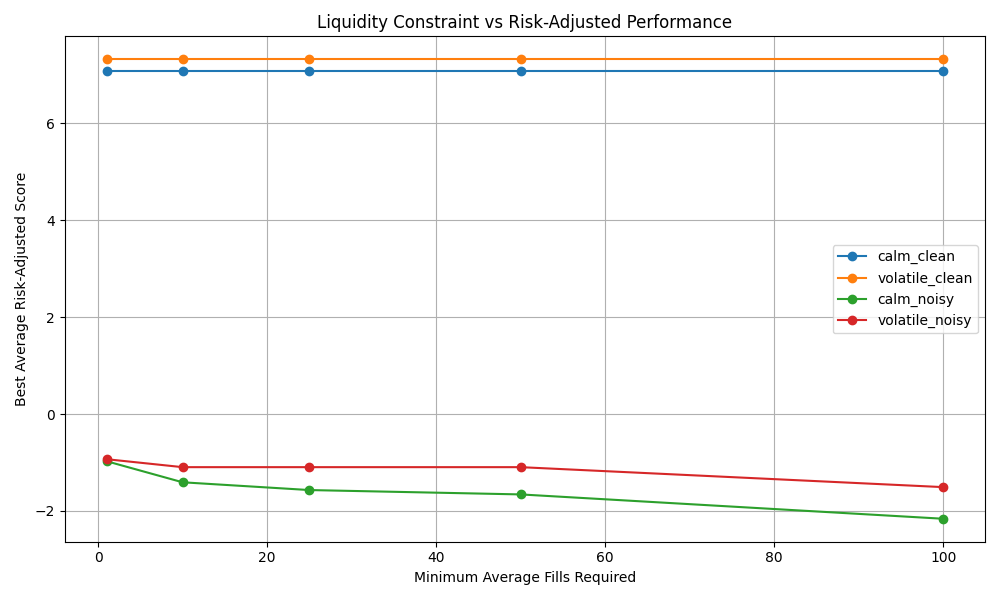

# Market-Making Simulator

A Python-based stochastic market-making simulator for testing how different quoting strategies perform under noisy price observations, inventory risk, stochastic price movement, and uncertain fills.

The project models a simplified market maker that repeatedly posts bid and ask quotes. When quotes are filled, the simulator updates cash, inventory, mark-to-market PnL, and risk-adjusted performance metrics.

This is a controlled simulation project, not a live trading system.

---

## Project Motivation

Market makers provide liquidity by posting bid and ask quotes. Their performance depends on several competing forces:

- quoting tightly enough to get fills
- quoting wide enough to avoid bad trades
- managing inventory risk
- reacting to noisy fair-value estimates
- adapting to different volatility and noise regimes

This project explores those tradeoffs through simulation experiments, parameter optimization, and an interactive Streamlit dashboard.

---

## Features

- Stochastic midprice simulation
- Brownian motion price process
- Noisy observed midprice signal
- Probabilistic fill model
- Inventory and cash accounting
- Mark-to-market PnL calculation
- Risk-adjusted scoring
- Strategy comparison
- Parameter optimization
- Regime-specific optimization
- Fill-constrained analysis
- Out-of-sample optimized parameter evaluation
- Interactive Streamlit dashboard
- Saved experiment results and visualizations

---

## Strategies

The simulator compares four quoting strategies.

### Fixed Spread

Quotes a fixed bid/ask spread around the observed midprice.

This is the simplest baseline strategy. It does not actively manage inventory or uncertainty.

### Inventory-Aware

Shifts quotes based on current inventory.

When inventory is positive, quotes shift downward to encourage selling. When inventory is negative, quotes shift upward to encourage buying back.

### Uncertainty-Aware

Widens the spread when recent observed price changes become more volatile.

This helps the strategy avoid trading too aggressively when the fair-value signal is unreliable.

### Inventory + Uncertainty-Aware

Combines inventory-aware quote shifting with uncertainty-aware spread widening.

This strategy manages both inventory risk and noisy fair-value estimation.

---

## Core Simulation Loop

At each time step:

1. The true midprice moves according to a stochastic price process.
2. The bot observes a noisy version of the true midprice.
3. The selected strategy chooses a bid and ask quote.
4. The simulator determines whether the bid or ask gets filled.
5. Cash, inventory, PnL, and risk metrics are updated.

The bot does not directly observe the true midprice. It quotes using the observed midprice, while fills and final PnL are evaluated against the hidden true midprice.

---

## Experiments

The project includes several experiment types.

### Observation-Noise Experiment

Tests how strategies behave as the bot's observed fair-value estimate becomes noisier.

Output:

```text
results/experiment_results.csv
```

Plots include:

```text
results/plots/avg_pnl_by_noise.png
results/plots/risk_adjusted_score_by_noise.png
results/plots/avg_inventory_by_noise.png
results/plots/max_inventory_by_noise.png
results/plots/fills_by_noise.png
results/plots/avg_spread_by_noise.png
results/plots/sample_true_vs_observed_midprice.png
```

### Volatility-Regime Experiment

Tests how strategies behave as true Brownian market volatility changes.

Output:

```text
results/volatility_experiment_results.csv
```

Plots include:

```text
results/plots/avg_pnl_by_volatility.png
results/plots/risk_adjusted_score_by_volatility.png
results/plots/avg_inventory_by_volatility.png
results/plots/max_inventory_by_volatility.png
results/plots/fills_by_volatility.png
results/plots/avg_spread_by_volatility.png
results/plots/estimated_uncertainty_by_volatility.png
```

### Parameter Optimization

Grid-searches over:

- base spread
- inventory skew
- uncertainty sensitivity

Output:

```text
results/parameter_optimization_results.csv
results/plots/top_parameter_sets.png
```

### Regime-Specific Optimization

Finds the best parameters in four regimes:

- calm and clean
- volatile and clean
- calm and noisy
- volatile and noisy

Output:

```text
results/regime_parameter_optimization_results.csv
results/best_parameters_by_regime.csv
```

Plots include:

```text
results/plots/best_score_by_regime.png
results/plots/best_base_spread_by_regime.png
results/plots/best_inventory_skew_by_regime.png
results/plots/best_uncertainty_sensitivity_by_regime.png
```

### Fill-Constrained Analysis

Studies what happens when the market maker is required to trade at least a minimum amount.

This helps separate strategies that perform well by providing liquidity from strategies that perform well by barely trading.

Output:

```text
results/fill_constrained_best_parameters.csv
results/plots/fill_constraint_tradeoff.png
```

### Out-of-Sample Optimized Parameter Evaluation

Evaluates optimized regime parameters on fresh simulations using a different random seed.

Output:

```text
results/optimized_parameter_evaluation.csv
```

---

## Selected Results

### True vs Observed Midprice

This plot shows the hidden true midprice and the noisy observed midprice used by the strategy.



### Risk-Adjusted Score by Observation Noise

This plot shows how each strategy performs as the observed fair-value estimate becomes noisier.


### Best Score by Regime

This plot shows how the optimized strategy performs across calm/clean, volatile/clean, calm/noisy, and volatile/noisy regimes.



### Fill Constraint Tradeoff

This plot shows the tradeoff between requiring more fills and maintaining strong risk-adjusted performance.



---

## Main Findings

The experiments suggest several patterns:

- Inventory skew is consistently important for controlling risk.
- In clean regimes, tighter spreads and frequent trading can perform well.
- In noisy regimes, uncertainty-aware spread widening becomes more important.
- Without fill constraints, the optimizer may choose to barely trade in noisy markets.
- Fill constraints reveal the tradeoff between liquidity provision and risk-adjusted performance.
- Observation noise can be more damaging than volatility alone because the strategy quotes using an inaccurate estimate of fair value.

---

## Dashboard

The project includes an interactive Streamlit dashboard.

Run it with:

```bash
python3 -m streamlit run src/dashboard.py
```

Dashboard tabs:

- Project Story
- Single Simulation
- Strategy Comparison
- Preset Evaluation
- Saved Results

The dashboard allows users to change simulation parameters, run individual simulations, compare strategies, evaluate optimized presets, and inspect saved experiment outputs.

---

## How to Run

Install dependencies:

```bash
python3 -m pip install -r requirements.txt
```

Run tests:

```bash
python3 -m pytest
```

Run all main experiments:

```bash
python3 -m src.main
```

Run parameter optimization:

```bash
python3 -m src.optimize
```

Run regime-specific optimization:

```bash
python3 -m src.optimize_regimes
```

Analyze regime optimization results:

```bash
python3 -m src.analyze_regime_results
```

Run fill-constrained analysis:

```bash
python3 -m src.analyze_fill_constraints
```

Generate the written analysis summary:

```bash
python3 -m src.analysis_report
```

Evaluate optimized parameters out of sample:

```bash
python3 -m src.evaluate_optimized_parameters
```

Run the dashboard:

```bash
python3 -m streamlit run src/dashboard.py
```

---

## Project Structure

```text
src/
  __init__.py
  main.py
  experiments.py
  simulator.py
  strategies.py
  fill_model.py
  price_process.py
  sim_stats.py
  plotting.py
  optimization.py
  optimize.py
  optimize_regimes.py
  analyze_regime_results.py
  analyze_fill_constraints.py
  analysis_report.py
  evaluate_optimized_parameters.py
  dashboard.py

tests/
  test_fill_model.py
  test_price_process.py
  test_sim_stats.py
  test_simulator.py
  test_strategies.py

results/
  experiment_results.csv
  volatility_experiment_results.csv
  parameter_optimization_results.csv
  regime_parameter_optimization_results.csv
  best_parameters_by_regime.csv
  fill_constrained_best_parameters.csv
  optimized_parameter_evaluation.csv
  analysis_summary.md
  plots/
```

---

## Limitations

This is a simplified simulator. It does not yet include:

- real limit order book data
- queue position
- historical bid/ask quote replay
- exchange fees or rebates
- latency
- competing market makers
- real execution constraints

Because of this, the results should be interpreted as controlled simulation experiments rather than claims about live trading profitability.

---

## Possible Future Extensions

Potential future improvements include:

- replaying historical market prices from CSV data
- using real quote/trade data
- adding transaction fees and rebates
- modeling latency
- adding a more realistic order book
- testing adaptive strategies that learn parameters online
- adding adverse-selection metrics
- separating realized spread from mark-to-market PnL